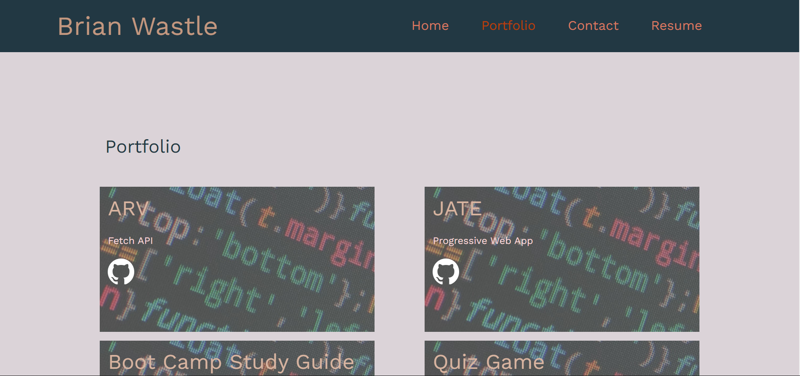

# <Your-Project-Title>

## Description

My motivation for this project was to create a professional and user-friendly single-page application portfolio. I built this project to showcase my skills and work samples to potential employers effectively.

The primary problem it solves is providing employers with an easy-to-navigate platform to assess my qualifications and work. It offers a seamless experience for employers to view my About Me, Portfolio, Contact information, and Resume without page reloads.

Throughout the project, I learned how to create a responsive and dynamic single-page application using React. I gained proficiency in React components, state management, and routing, allowing me to present information in an organized and interactive manner. Additionally, I improved my HTML and CSS skills for creating a visually appealing and professional-looking portfolio. Overall, this project not only helps me present my work but also demonstrates my ability to build functional and user-centric web applications.


## Installation

Fork a copy of the repo from my [github](https://github.com/brian-wastle/React-Portfolio) and run ```npm i``` in the terminal

## Usage

Navigate through the site with the navbar at the top of the page. Links to the deployed project and Github repository are available on the Portfolio page. A downloadable copy of my resume is available on the Resume page. 



